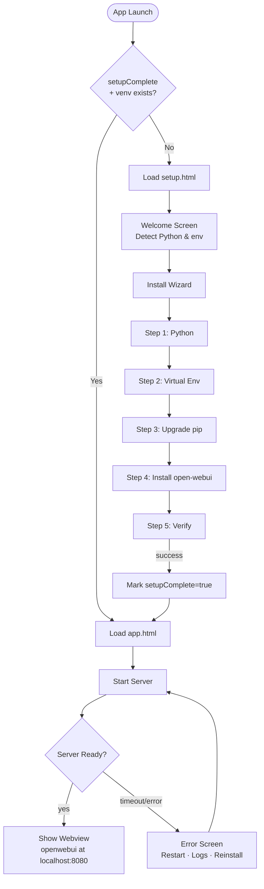
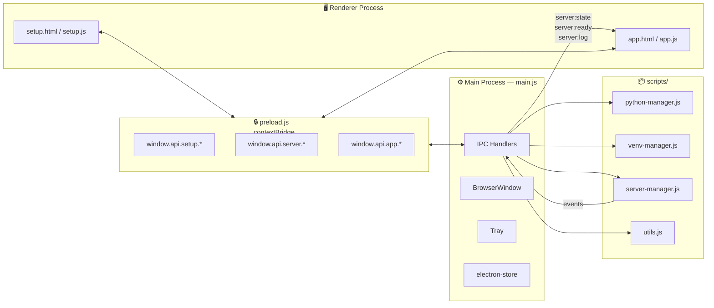
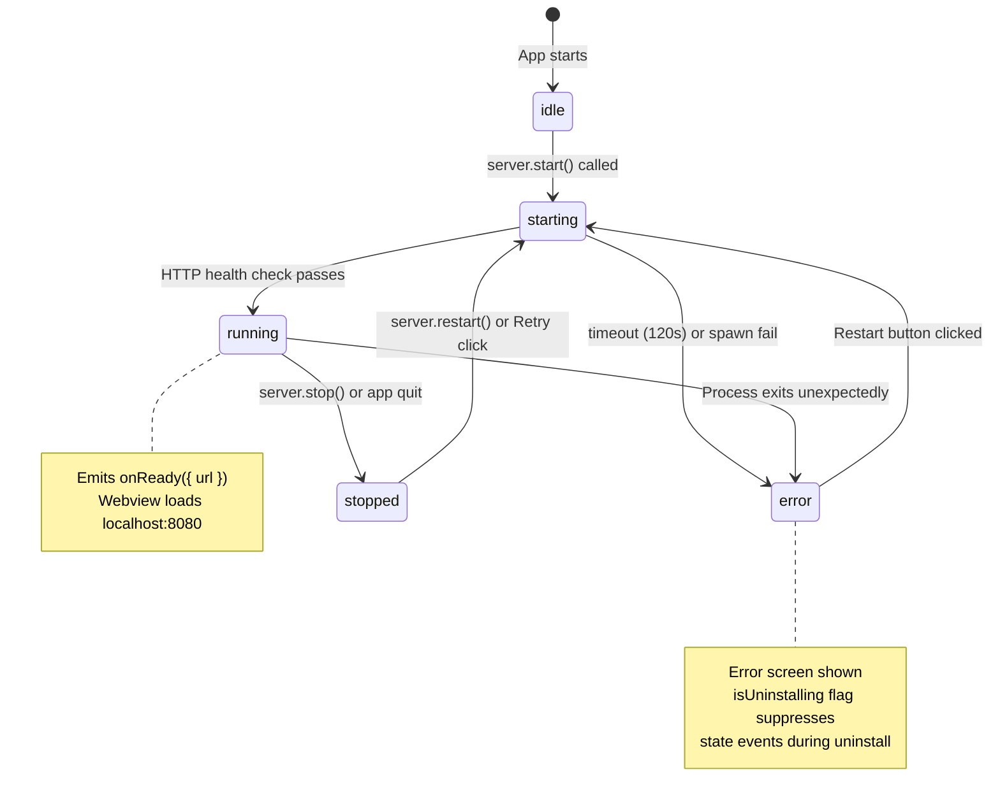
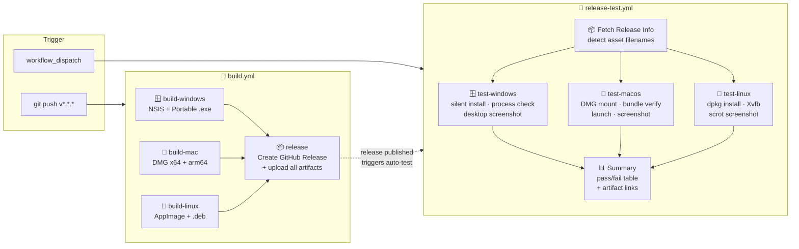
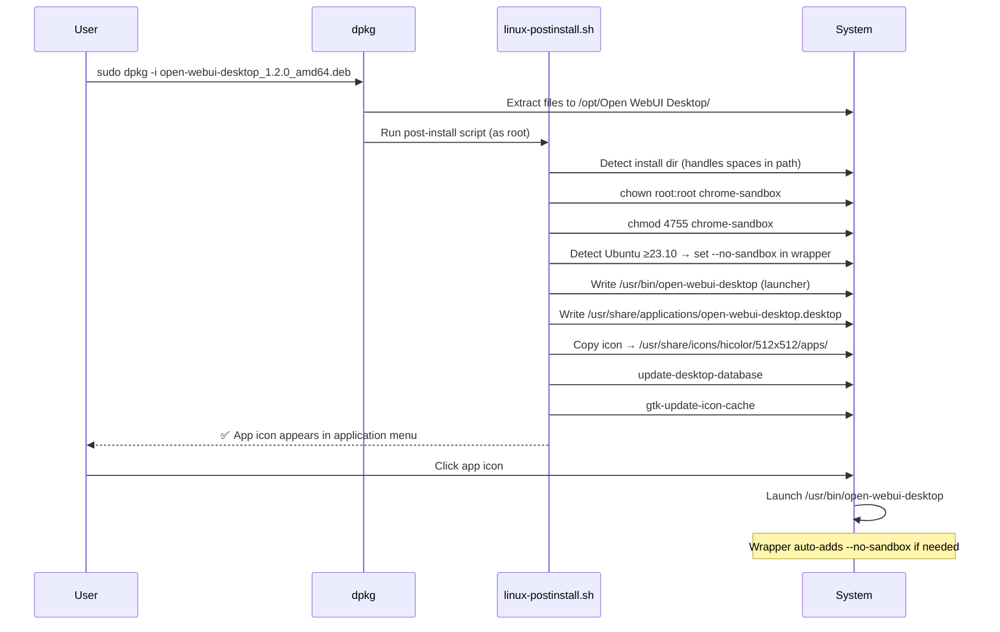

<div align="center">


# Open WebUI Desktop

**A native desktop wrapper that installs, manages, and runs [Open WebUI](https://github.com/open-webui/open-webui) locally — no Docker, no terminal, no setup.**

[](https://github.com/saiteja007-mv/open-webui-desktop/actions/workflows/build.yml)
[](https://github.com/saiteja007-mv/open-webui-desktop/actions/workflows/release-test.yml)
[](https://github.com/saiteja007-mv/open-webui-desktop/releases/latest)
[](#-download)
[](https://www.electronjs.org/)

</div>

---

## ✨ What It Does

Open WebUI Desktop wraps the full [Open WebUI](https://github.com/open-webui/open-webui) AI chat interface into a single installable desktop app. First launch walks you through a guided installer — it handles Python detection, virtual environment creation, and package installation automatically. After that, just open the app and your local AI interface is ready.

- 🔒 **Fully local** — no cloud dependency, all data stays on your machine
- ⚡ **One-click install** — guided wizard installs Open WebUI into an isolated Python venv
- 🖥️ **Pure black UI** — matches Open WebUI's native aesthetic
- 🔄 **Server lifecycle management** — starts, monitors, and restarts the server automatically
- 🗑️ **Clean uninstall** — removes the venv and all packages from within the app

---

## 📥 Download

| Platform | Installer | Format |
|----------|-----------|--------|
| 🪟 **Windows** | [Open.WebUI.Desktop.Setup.1.2.0.exe](https://github.com/saiteja007-mv/open-webui-desktop/releases/latest) | NSIS one-click installer |
| 🪟 **Windows Portable** | [Open.WebUI.Desktop.1.2.0.exe](https://github.com/saiteja007-mv/open-webui-desktop/releases/latest) | No install required |
| 🍎 **macOS (Intel)** | [Open.WebUI.Desktop-1.2.0.dmg](https://github.com/saiteja007-mv/open-webui-desktop/releases/latest) | DMG disk image |
| 🍎 **macOS (Apple Silicon)** | [Open.WebUI.Desktop-1.2.0-arm64.dmg](https://github.com/saiteja007-mv/open-webui-desktop/releases/latest) | DMG disk image |
| 🐧 **Linux (Debian/Ubuntu)** | [open-webui-desktop_1.2.0_amd64.deb](https://github.com/saiteja007-mv/open-webui-desktop/releases/latest) | `.deb` package |
| 🐧 **Linux (AppImage)** | [Open.WebUI.Desktop-1.2.0.AppImage](https://github.com/saiteja007-mv/open-webui-desktop/releases/latest) | Portable AppImage |

> **Linux note:** After `dpkg -i`, the post-install script automatically fixes sandbox permissions and creates the `/usr/bin/open-webui-desktop` launcher. No manual steps required.

---

## 🏗️ Architecture

### Application Flow



### IPC Architecture



### Server Lifecycle



### CI/CD Pipeline



### Linux Installation Flow



---

## 🛠️ Development

### Prerequisites

- **Node.js** 18+
- **npm** 9+
- **Python** 3.10+ (for running Open WebUI locally)

### Setup

```bash
git clone https://github.com/saiteja007-mv/open-webui-desktop.git
cd open-webui-desktop
npm install
npm start
```

### Scripts

| Command | Description |
|---------|-------------|
| `npm start` | Run in development (`electron .`) |
| `npm run build:win` | Build Windows `.exe` installers → `dist/` |
| `npm run build:mac` | Build macOS `.dmg` (x64 + arm64) → `dist/` |
| `npm run build:linux` | Build `.AppImage` + `.deb` → `dist/` |
| `npm run build:all` | Build all platforms |

---

## 📁 Project Structure

```
open-webui-desktop/
├── main.js                    # Electron main process
│                              # Window · Tray · IPC · server lifecycle
├── preload.js                 # contextBridge API (window.api)
├── package.json               # electron-builder config in "build" field
│
├── src/
│   ├── app.html / app.js      # Main window: webview + loading/error screens
│   ├── app.css                # Pure black theme (#000000)
│   ├── setup.html / setup.js  # First-run installation wizard
│   └── setup.css
│
├── scripts/
│   ├── python-manager.js      # Python detection & installation
│   ├── venv-manager.js        # venv creation, pip, open-webui install
│   ├── server-manager.js      # Spawn open-webui.exe, health check, events
│   └── utils.js               # Paths, logging helpers
│
├── assets/
│   ├── icon.png               # App icon  (512×512)
│   └── tray-icon.png          # Tray icon (256×256)
│
├── build/
│   ├── linux-postinstall.sh   # deb post-install: sandbox · launcher · .desktop
│   └── open-webui-desktop.desktop
│
└── .github/workflows/
    ├── build.yml              # Build & release (on v* tag)
    └── release-test.yml       # Cross-platform install tests
```

---

## 🚀 Releasing

```bash
# 1. Bump version in package.json
# 2. Commit, tag, push — CI does the rest
git add package.json
git commit -m "vX.Y.Z — description"
git tag vX.Y.Z
git push origin master && git push origin vX.Y.Z
```

The `build.yml` workflow builds all 3 platforms in parallel and publishes a GitHub Release automatically. The `release-test.yml` workflow then runs cross-platform install/launch tests and uploads screenshots as artifacts.

---

## 🔒 Security & Privacy

- All processing is **100% local** — no data ever leaves your machine
- Open WebUI runs inside an isolated Python virtual environment
- The Electron renderer uses `contextIsolation: true` with a strict `contextBridge` — no `nodeIntegration`
- Content Security Policy enforced on all HTML pages

---

## 📋 Requirements

| Platform | Minimum | Notes |
|----------|---------|-------|
| Windows | Windows 10 x64 | Unsigned installer — SmartScreen may warn |
| macOS | macOS 10.13 (x64) / 11.0 (arm64) | Unsigned — right-click → Open to bypass Gatekeeper |
| Linux | Ubuntu 20.04+ / Debian 11+ | `.deb` or AppImage; post-install handles sandbox setup |
| Python | 3.10+ | Auto-detected; installer can download if missing |
| Disk | ~2 GB | For Open WebUI and its dependencies |
| RAM | 4 GB+ | 8 GB recommended for running LLMs |

---

<div align="center">

Built with [Electron](https://electronjs.org) · Powered by [Open WebUI](https://github.com/open-webui/open-webui)

</div>
